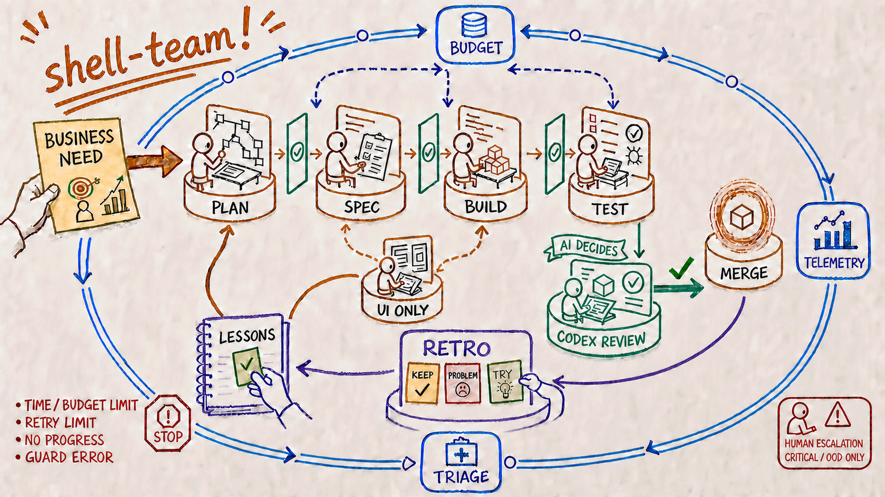

# shell-team

[](README.md)
[](README.ja.md)

[](https://github.com/RipsawJP/shell-team/actions/workflows/check-handoff.yml)
[](https://github.com/RipsawJP/shell-team/tags)
[](docs/distribution.md)
[](#design-choices)


## Why I am building this

**Honestly, I just want less work.**

If I ask AI to implement something but still have to supervise every phase, read the code, request every correction, and make the final call myself, it does not feel particularly autonomous.

shell-team is a personal project testing how much of specification, implementation, verification, and repair an AI team can finish without requiring a human at every step. Zero humans is not the goal, nor is strict loyalty to labels such as Loop Engineering or Graph Engineering. I borrow whatever is useful. The test is whether it reduces my work without making that convenience expensive later.

The longer, personal version is in [“Honestly, I Just Want Less Work — Loop Engineering? Graph Engineering? The Name Is, Well, Not That Important”](docs/essays/i-just-want-less-work.md).



## What shell-team is

A Claude Code **plugin** that drops a dev team into any repo. **PM, Tech Lead, Engineer, QA, and a Codex-powered cross-provider Reviewer** (plus a UI Designer that joins only for UI work, and a Scrum-Master) follow a Spec-Driven workflow with explicit hand-off gates.

- Enforces **plan → specify → conditional design → implement → validate → cross-provider review**, with a status flag at every boundary.
- Runs the final review through **Codex CLI (OpenAI)** so it comes from a different model family than the implementation team.
- Bounds every run with an explicit loop contract (BUDGET/STOP); `/goal` can drive one task to completion under the same guardrails.
- Feeds phase telemetry, retros, and lessons back into later runs.
- Installs once as a plugin and works across repos without per-repo copies or version drift.

See [docs/history.md](docs/history.md) for the story of how the project got here.

## Prerequisites

- Claude Code (≥ the version that supports plugins, v2.1.x).
- Codex CLI installed and authenticated. Run `/codex:setup` once if you have the Codex plugin, or follow https://developers.openai.com/codex/cli.
- **Sandbox-enabled sessions need extra settings.** See [docs/distribution.md#sandbox-enabled-permission-settings](docs/distribution.md#sandbox-enabled-permission-settings) for the Codex review path's required sandbox exclusion (`sandbox.excludedCommands`) and permission settings.

## Install

This repo is both the plugin and its own marketplace (`ripsawjp`). Install once per machine:

```text
/plugin marketplace add RipsawJP/shell-team
/plugin install shell-team@ripsawjp
```

Then initialize per-repo data once (scaffolds a single `.shell-team/` base dir with the board + default loop contract; host root files like `CLAUDE.md` and `.gitignore` are left untouched; idempotent — see [docs/adopting.md](docs/adopting.md)):

```text
/shell-team:team-init
```

**Decide once whether `.shell-team/` belongs in git.** Because the plugin never edits your root `.gitignore`, the base dir shows up as *untracked* in your repo — only the per-run telemetry inside it is ignored, via a self-contained `<base>/.gitignore`. Both choices are supported, and the plugin will not make the call for you:

- **Track it** — the board, specs, and review artifacts become versioned project records (that is how this repo dogfoods itself).
- **Keep it out of git** — add `.shell-team/` to your repo's `.gitignore` (scoped to that repo, trivially reversed), or to your global excludes (`git config --global core.excludesFile`) if you would rather keep it out of every repo you work in. The global route is machine-wide, so it also hides the base dir in a repo where you later *do* want the board tracked; `!.shell-team/` in that repo's root `.gitignore` brings it back, because repo-level patterns outrank the global file. This repo carries that line for exactly that reason. [docs/adopting.md](docs/adopting.md) covers one further consequence, for tooling that asks git whether a path is ignored.

Full details, updates, and the air-gapped fallback: [docs/distribution.md](docs/distribution.md).

## Usage

The default way to use shell-team is **conversational — just describe what you want**, the way you'd ask for anything else in a chat session:

```text
shell-team a /healthz endpoint that returns build sha + uptime
```

The main Claude session recognizes a non-trivial request and routes it through the team (Plan → Specify → Implement → Validate → Review), pausing for you before any merge — the same way you already get a cross-provider code review without typing a slash command. See [docs/usage-conversational.md](docs/usage-conversational.md) for the full model, more example conversations, and the one opt-in step that makes the *full* loop fire reliably from chat.

It also works standalone, one agent or skill at a time, when you want to be explicit:

```text
# Full pipeline, explicit slash command
/shell-team:run add a /healthz endpoint that returns build sha + uptime

# Just an independent cross-provider code review
/shell-team:review focus on auth and input validation

# Respond to review feedback already on your PR — Codex-evaluate + risk-gate the findings, then shell-team the adopted set
/shell-team:review-response respond to the review on PR #N

# Scaffold this repo to adopt the team (once per repo)
/shell-team:team-init

# Discover candidate work (failing CI / open PRs / loop-triage issues) — proposes, never edits the board
/shell-team:loop-triage

# Drive one board task to done on a self-paced loop (layered gate: check-acs -> check-intent (only when the spec carries a frozen intent block) -> check-provenance -> QA -> Codex, bounded by loop-guard)
/shell-team:goal T-XXX

# Or invoke an agent directly
@shell-team:pm-spec turn this request into a spec
@shell-team:engineer pick up T-XXX
```

## When the full loop fits (task aptitude)

**First branch — does the final verification surface close inside the loop?**

- **Closes inside the loop** (correctness is settled by *mechanical* verification — tests, lint, execution/output comparison): the full PM → Engineer → QA → Codex loop **fits**. QA and Codex can confirm the acceptance criteria empirically and statically, so a FAIL is caught inside the loop rather than after a human looks at the result.
- **Does not close inside the loop** (the final gate is *human visual inspection, a real renderer, or subjective evaluation* — e.g. slide/PDF layout, pixel-level UI polish, prose tone): the full loop is a **poor fit, or fits only in a limited way**. QA cannot substitute for the human eye, and the loop only surfaces the human visual gate at the very end, so a visual FAIL costs a whole round-trip and can churn the same code path for many rounds (observed in practice: 10+ rework rounds on a single visual task before a human caught the real issue).

**Provisional operation for visual-output tasks** (a stop-gap until a dedicated short-cycle / variant loop is built): do **not** put such a task on a single full-loop pass. Instead run a short manual cycle (implement, render, human check) where the human views the real rendered output each turn; keep spec / QA in a supporting role rather than as the completion gate.

> This first branch anticipates the same shape as a grounded-AI-evaluator's OOD-novelty / human-gate criterion: a verification surface that cannot be mechanically grounded escalates to a human.

## Layout

```
.
├── .claude-plugin/
│   ├── plugin.json                  # plugin manifest (name, version)
│   └── marketplace.json             # self-hosted marketplace (ripsawjp)
├── agents/
│   ├── tech-lead.md                 # Orchestrator (read-only, returns Routing Map)
│   ├── pm-spec.md                   # Spec writer
│   ├── ui-designer.md               # Design for UI work only (frontend-design Skill; optional dep)
│   ├── engineer.md                  # Implementer (non-worktree by default; opt-in isolation)
│   ├── qa-verifier.md               # Test runner / acceptance checker
│   ├── codex-reviewer.md            # Codex CLI cross-provider reviewer
│   ├── scrum-master.md              # Retro / lessons generator
│   └── triage-orchestrator.md       # Outer-loop triage consolidator (propose-only)
├── skills/
│   ├── run/SKILL.md            # /shell-team:run <request>
│   ├── goal/SKILL.md                # /shell-team:goal (self-verifying runtime loop)
│   ├── review/SKILL.md              # /shell-team:review
│   ├── review-response/SKILL.md     # /shell-team:review-response (triage received review feedback)
│   ├── team-init/SKILL.md           # /shell-team:team-init (scaffold a repo)
│   └── loop-triage/SKILL.md         # /shell-team:loop-triage (discover work)
├── bin/                             # all on PATH while the plugin is enabled
│   ├── check-handoff.sh             # tasks/todo.md hand-off linter
│   ├── check-contract.sh            # loop-contract schema linter
│   ├── loop-guard.sh                # runtime BUDGET/STOP enforcement
│   ├── log-run.sh / check-run.sh    # telemetry writer + JSONL lint
│   ├── gen-loop-replay.sh           # renders a run's telemetry as an HTML replay page
│   ├── discover-work.sh             # read-only triage discovery engine
│   ├── team-init.sh                 # adopting-repo scaffolder
│   └── install                      # legacy vendoring fallback
├── templates/                       # generic scaffolds used by team-init
├── docs/
│   ├── essays/                      # personal essays behind the project
│   ├── workflow.md                  # phase diagram + hand-off contract
│   ├── distribution.md              # install / update / dogfood
│   └── history.md                   # how the project evolved
└── .shell-team/                     # this repo's own per-repo data (board, specs, loops, retros, reviews)
```

## Phase flow

```
[Plan]      tech-lead       → Routing Map
[Specify]   pm-spec         → docs/specs/<slug>.md   READY_FOR_ARCH
[Design]    ui-designer     → (UI only) design note   no new flag
[Implement] engineer        → code + tests           READY_FOR_QA
[Validate]  qa-verifier     → run + check criteria   READY_FOR_REVIEW
[Review]    codex-reviewer  → Codex CLI verdict       READY_FOR_MERGE
```

`[Design]` is **conditional** (only when the task involves UI work). It carries no new status flag — the design note's existence gates the engineer. The `frontend-design` Skill is an optional dependency (degrades to in-house guidance, announced not silent, when absent).

See [docs/workflow.md](docs/workflow.md) for the hand-off contract and shortcuts.

## Operating loop

The agent pipeline above is the **inner loop**. An **outer loop** of operating discipline wraps it:

- **Loop contracts** — every loop declares TRIGGER/SCOPE/ACTION/BUDGET/STOP/REPORT in `tasks/loops/*.contract.yaml`; `bin/check-contract.sh` lints them. BUDGET + STOP are mandatory.
- **Runtime guardrails** — `bin/loop-guard.sh` enforces the contract's BUDGET/STOP at run time (a fail-closed runaway / billing kill-switch).
- **Telemetry** — `/shell-team:run` emits one `--span` row per phase and one `--event` row per hand-off (event vocabulary: `handoff|rework|gate|human|release`) via `bin/log-run.sh`; `bin/check-run.sh` lints the JSONL, `bin/gen-loop-replay.sh` renders either kind back as a run-replay page (see [Replaying a run](#replaying-a-run)), and cross-run roll-ups surface systemic issues instead of showing up one run at a time. Each span row also carries a nullable `--instance` discriminator naming which instance of a role produced it, so a per-instance fan-out's hand-off records stay attributable to the instance that emitted them. Every append is serialized behind a never-stealing directory lock (default 10s bounded wait, overridable via `TEAM_LOG_LOCK_TIMEOUT`) so concurrent writers can't interleave a row — a lock that can't be acquired in time writes nothing and exits 3 rather than tearing a row — and `--seq auto` derives the next counter per `run_id` from the file itself under that same lock, for a caller that doesn't want to carry its own counter.
- **Within-phase fan-out** — a phase whose own verification work is mechanically enumerable can split it across N instances of one role and reduce the N per-instance partial verdicts to one authoritative verdict with `bin/aggregate-verdicts.sh`, rather than run serially. `bin/check-fanout-instances.sh` then ties the fan-out's own telemetry rows to that merged verdict, refusing (a classified exit code, empty stdout) unless every selected row carries a discriminator, every discriminator conforms to the writer's own grammar, no id is claimed by two different roles, and the telemetry's instance set and the merged record's declared part set agree in both directions. Opt-in only — no phase is rewired to fan out by default; the choice is made inside the Validate phase, where the run skill's own fan-out step documents the degree rule, the liveness requirement and the telemetry convention. Before launching, the orchestrator writes a **launch record** at `<runs>/fanout-<label>.launch` — a versioned, terminated declaration of the population, the requested/achieved N, the cap's ground, the per-unit assignment and per-instance liveness — whose gated fields are already arguments to the two checkers above, so no third checker reads it.
- **Situational dispatch record** — `tech-lead`'s Routing Map decides, per axis, which mechanism runs a task's implement phase and which runs its verify phase, and the orchestrator transcribes each decision onto the task's board entry under the closed-vocabulary grammar `- dispatch: <axis> — <value> — <unconditional|conditional> — <ground>`. `bin/close-out.sh` validates every such sub-bullet when present and refuses a malformed one (a value from another axis's set, a duplicated axis, an axis outside the closed set, a bad modality, or a ground with no priced-line prefix) — an entry carrying none of them still closes out.
- **Spec authorship as a dispatch axis** — `specify`, closed over `pm-authored` (the shipped default: `pm-spec` writes the spec) and `operator-authored` (the coordinating session has already written it, typically because a judgment-density bottleneck made delegating authorship worthless — see [Choosing who authors the spec](docs/adopting.md#choosing-who-authors-the-spec-t-1091)). Either way the loop's machinery — the freeze sweep, both review gates, the interventions ledger — runs unchanged; `pm-spec` participates as a conformance formatter rather than an author in the `operator-authored` branch.
- **Concurrent-worktree reconcile** — when 2+ engineer instances have each committed disjoint work in their own linked worktree, `bin/land-worktree.sh` lands each worker onto one coordinator branch in turn, behind a never-stealing lock (default 10s bounded wait, overridable via `TEAM_LAND_LOCK_TIMEOUT`), refusing rather than landing on any path-level collision. Opt-in only — the run skill's own `reconcile-step` section documents when to use it. The guarantee is path-level and textual only: it does not guarantee semantic or interface independence between workers.
- **Opt-in triage** — `/shell-team:loop-triage` (`bin/discover-work.sh`) is read-only: it finds failing CI / open PRs / labelled issues and *proposes* todo candidates, never editing the board.
- **Model routing** — agent roles are assigned across model tiers (planning vs. execution vs. cross-provider review) so cost tracks each role's judgment load, with an explicit re-evaluation trigger whenever the model landscape or cost structure shifts.

See [docs/history.md](docs/history.md) for how this operating discipline evolved.

## Binding roles to executors

Each of the six inner-loop roles — `tech-lead`, `pm-spec`, `engineer`,
`qa-verifier`, `codex-reviewer`, `ui-designer` — is host-assignable to a
specific executor (provider + model + effort + adapter) through a
`<base>/binding.conf`; with no host config, the plugin-shipped
`templates/binding-default.conf` is the **shipped default**. The how-to,
the config grammar, the fail-closed refusals and each adapter's own
effort values live in [docs/adopting.md](docs/adopting.md) — the single
canonical detail surface for this mechanism — and in `bash
resolve-executor.sh --help`, which is that script's own header and
cannot drift from it. **The honest boundary** has two axes: the binding
gates **whether** a call proceeds in the loops that consult it — in
`/shell-team:run` and `/shell-team:goal`, resolution runs first and a
refusal stops the phase rather than falling back, so a rebind can stop a
call outright, while `/shell-team:review` never consults the binding and
`/shell-team:review-response` consults it only through the rework it
hands to the run loop (issue **#245**) — and it never changes **how** a
proceeding call is executed, where it moves only what resolution reports
and what **telemetry** records, provider, model, effort and adapter
alike, so no
alternate-executor **invocation path** is wired. Illustratively, on that
second axis: the model still comes from the role's own `agents/<role>.md`
pin (issue **#236** tracks retiring those pins for the five
`claude-cli`-bound roles only, `codex-reviewer` excluded), a declared
effort is recorded but applied to no call, and executor-level routing is
not resolved at all. Every bound value is declared, never an observation
of what executed. See [Design choices](#design-choices) for the reviewer
row's own shipped default and its rationale.

## Replaying a run

A run's telemetry (span rows plus event rows) replays as one self-contained HTML page — no network, no external asset, no build step; it opens straight from a `file://` URL.

Generate one:

```bash
bash gen-loop-replay.sh <run-id>
```

(with the plugin loaded, `bin/` is on `PATH`, so `bash gen-loop-replay.sh` resolves it there regardless of the executable bit — no `bin/` prefix and no `PATH` setup of your own needed.) The page lands at `<runs>/replay-<run-id>.html`, where `<runs>` is whatever `bin/team-paths.sh --get runs` resolves for this repo — it is already `git-ignore`d, so there is nothing to add to an ignore file. Pass `--out <path>` to write it somewhere else instead.

**Caveat**: the board-flag rail only lights for a run whose `handoff` events carry the board flag on `--label` as a bare token (`READY_FOR_ARCH` … `READY_FOR_MERGE`) — see `skills/run/SKILL.md` for where that convention is produced. A run recorded without those labels — still the dominant case — shows the empty-state caption instead.

No run of your own yet? The committed fixture demonstrates a rail that does light (run this from a shell-team checkout root, since the fixture path below is this repository's own):

```bash
bash bin/gen-loop-replay.sh 20260801T000000Z-flagrail --runs-dir tests/gen-loop-replay/fixtures/flag-rail --out /tmp/replay-demo.html
```

`--out` is required in this demo — omitting it would default the page into the fixture directory under `tests/`, leaving an untracked file behind.

## Deriving a population set

A record's set arithmetic — a population total, a set delta, a bucket
split — is produced by `derive-populations.sh`, never counted by eye: it
runs two to eight named population-extraction commands under a pinned
`LC_ALL=C` collation and emits one delimited block a record embeds
verbatim, preceded by a `- reproduce: <command>` line carrying the exact
command that regenerates it.

```bash
bash derive-populations.sh --label agents --set "registered=git ls-files -- agents/*.md" --set "reviewers=grep -l codex-reviewer agents/*.md"
```

(with the plugin loaded, `bin/` is on `PATH`, so `bash derive-populations.sh` resolves it there regardless of the executable bit — no `bin/` prefix needed, the same convention `## Replaying a run` documents for `gen-loop-replay.sh`.) Each `--set name=command` line is captured, deduplicated and partitioned into a gap-free, overlap-free membership signature; `--accept-status name=csv` declares additional exit statuses accepted for one named set beyond the default of `0` (the "`git grep` exits `1` for no match" case). `bash derive-populations.sh --help` documents the full grammar.

Every structural identifier — `--label`, a `--set` name, an `--accept-status` name — must match `^[A-Za-z0-9][A-Za-z0-9_-]*$`: no control character, no `+` (the byte the emitted signature joins set names with), no whitespace. A `--set` command runs under `pipefail`, so a legitimate mid-pipeline non-zero exit (e.g. `git grep pattern | sort` when nothing matches) is exactly the case `--accept-status name=1` exists to declare acceptable.

Exit codes: `0` the block was written to stdout; `1` a refusal about the input's *content* (an unaccepted set exit status — under `pipefail`, pair a legitimate mid-pipeline non-zero exit with `--accept-status` — or an item containing a control character; stdout stays empty, never a false empty set); `2` a usage error about the *invocation* (a missing `--label`, an identifier outside the grammar above, fewer than two or more than eight `--set` values, two sharing a name, or a `--set` command containing a control character). See `docs/loop-engineering/record-set-derivation.md` for this repository's own dogfooded derivations.

## Design choices

- **Read-only Orchestrator**: `tech-lead` only plans — the main session executes the map.
- **Tight tool permissions**: PM is read+spec-write only, QA is read+bash only, Reviewer can't mutate code.
- **Files are the only shared state**: the board (`todo.md`) + status flags are the single source of truth between agents.
- **Single base dir, host root untouched**: adopted repos keep all operating files under one base dir (`.shell-team/` by default, resolved by `bin/team-paths.sh`; override with `TEAM_RUN_BASE`). `team-init` never edits the host's `CLAUDE.md` or root `.gitignore`. This repo runs on that same default layout, so its own board, specs, and retros live under `.shell-team/` too. The resolver still detects and supports the earlier `tasks/` + `docs/specs/` layout for repos that adopted the team before the base dir was consolidated — where these docs write `tasks/…` or `docs/specs/…`, they name the same artifacts in that legacy layout. See [docs/adopting.md](docs/adopting.md).
- **Engineer is non-worktree by default**: its edits land directly on the current feature branch; the orchestrator opts into `isolation: worktree` at invocation only for parallel implementations.
- **The reviewer's cross-provider binding is the shipped default**: `codex-reviewer` ships bound to Codex CLI because a model reviewing output from its own family shares its blind spots. A host-authored `binding.conf` may rebind `codex-reviewer` to a same-family executor; doing so changes which executor gets resolved and which value telemetry records, but does not wire up an alternate-executor invocation path and does not guarantee cross-provider review once such a rebind exists. If Codex CLI is unavailable, the review returns `BLOCKED` rather than falling back to Claude.

## Versioning

Release history lives in **[CHANGELOG.md](CHANGELOG.md)** (日本語: [CHANGELOG.ja.md](CHANGELOG.ja.md)) — one entry per release, newest first, from the current release back to the pre-plugin baseline (v0.0.1). Line policy in brief: breaking changes were allowed across the `v0.0.x → v0.1.x` boundary, and every release since has deepened the operating loop on top of the stable v0.2.0 footprint-consolidation baseline.

## Develop / dogfood

Working inside this repo, load the plugin from the working directory:

```bash
claude --plugin-dir ./       # then /reload-plugins after edits
```
