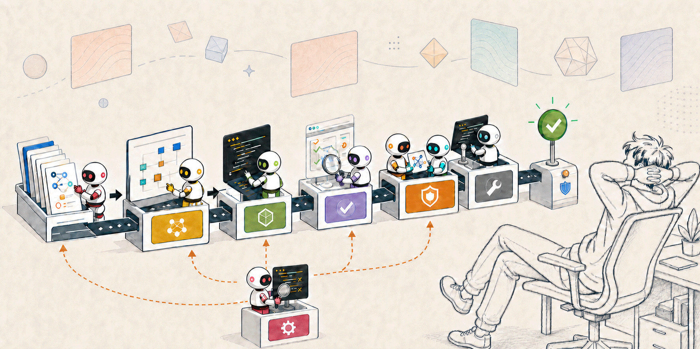

# Honestly, I Just Want Less Work

## Loop Engineering? Graph Engineering? The Name Is, Well, Not That Important

> This is a personal essay about why I am building shell-team, not a normative design contract. [The README](../../README.md) and the adopter-facing documentation — [workflow](../workflow.md), [adopting](../adopting.md), [distribution](../distribution.md) — remain the sources of truth for implemented behavior, guarantees, and constraints.

## I thought I delegated this to AI

I ask an AI to implement a feature. Then I explain the requirements, check the plan, watch the progress, read the generated code, inspect the test results, leave review comments, and check again that the fixes are complete.

I may not be typing the code, but I am still participating in the entire engineering loop.

That can still be faster than writing everything by hand. But I want more than fewer keystrokes. If possible, I would also like to stop holding the specification in my head, watching every step, repeating the same feedback, and verifying every “done” claim myself.

Honestly, I just want less work.

## Is a human really required?

Discussions about AI engineering often end with familiar advice: a human must review the result, a human must remain responsible, or a human must stay in the loop. Sometimes that is sensible. Asking a human can be faster, and some work still lacks an evaluator that can settle the result mechanically.

But if “a human is required” becomes an architectural assumption, it also ends the search for what AI might replace.

Consider what a human reviewer is actually judging: alignment with the request, acceptance criteria, observed behavior, compatibility with existing contracts, the provenance of decisions, and the risk of the change. If those things are captured in machine-readable form and evaluated from independent perspectives, perhaps fewer tasks need a human to keep reading the code on every pass.

shell-team is where I test that “perhaps” against real work.

## The name is, well, not that important

Harness Engineering, Loop Engineering, Graph Engineering: attractive new names keep appearing. Each contains useful ideas, and shell-team borrows from many of them.

I am not trying to become a faithful practitioner of one particular “Something Engineering.”

New terms attract attention, change shape, acquire new names, and eventually give way to the next term. Labels are useful for sharing and finding ideas. I am simply not interested in reshaping the project to fit one of them.

If a loop helps, use a loop. If a graph makes the work clearer, use a graph. If multiple models provide meaningful independence, use them. If one boring shell script is enough, use that. If asking a human once is genuinely faster, do that too.

What shell-team should be called matters less than how much work it lets me stop doing.

> **There is one test: does it make my life easier? 
> And will that convenience become expensive later?**

## A little rigor in pursuit of laziness

Delegating to AI is not the same as trusting AI unconditionally.

If I walk away and return to a broken result and a large cleanup, I did not eliminate work; I merely postponed it. Letting a human stop watching every step requires replacing human checks with reproducible mechanisms.

shell-team freezes the request and acceptance criteria as intent and records the provenance of non-trivial implementation decisions. QA verifies the actual code and outputs rather than the implementer's explanation. Codex, from a different model family than the Claude implementation team, performs an independent review.

The loop has limits on iterations, wall-clock time, and lack of progress. It does not run until it can somehow declare success; it stops explicitly when it is no longer making useful progress. Failures become telemetry, retros, and lessons so that a human does not need to repeat the same warning forever.

Rigor is not the goal. It is the price of being able to look away.

## Where it is today

Today, shell-team covers specification, implementation, executable QA, cross-provider review, and bounded repair through `READY_FOR_MERGE`. `merge` and `push` remain human gates.

That is neither a final declaration that humans must always remain nor a promise that everything will eventually be fully autonomous. I want to adjust autonomy based on evidence about evaluator reliability, the risk of the work, and whether the verification surface can close mechanically.

Some work, such as visual taste or prose tone, still cannot be settled by the evaluators shell-team has today. Asking a human can be better than performing autonomy and churning for ten rounds. Increasing human work in order to achieve zero humans would miss the point.

## What success looks like

Being recognized as the correct implementation of Loop Engineering is not a success criterion. Neither is maximizing the number of agents, loops, or automated steps.

Success means I can state the goal and spend more time away from the process. When I return, there is a verified artifact rather than an agent's self-report. When the run fails, I can see why, and the same problem should require less attention next time.

**If I get less work and more reliable outcomes, that is enough.**
